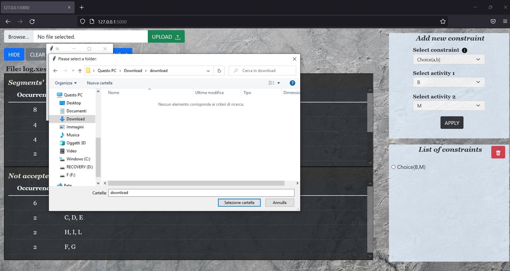

# SEC - SEgments Compliance

 ## Description
**SEgments Compliance** is a tool that helps user to identify the correct segments.
It allows you to load the interested **.xes** file and browse it using *DECLARE* rules.  
Eventually, when you are satisfied, you can download the final xes file.

 ## Table of content
1. How to locally install
2. How to use

## How to locally install
In order to install this tool locally you need:
1. Python (version 3.9): https://www.python.org/downloads/ 
2. Download the zip folder of the project

You can find a python installation guide here: https://python.land/installing-python

After installing everything, unzip the project and open the terminal of your computer and positioning within the project folder. 
So, type the following commands:
<code>pip install -r requirements.txt</code> 
<code>python main.py</code> 

If the commands gives you some error execute these lines: 

**For Windows:** 
<code>py -3 -m venv .venv</code> 
<code>.venv\scripts\activate</code> 
<code>pip install -r requirements.txt</code> 
<code>python main.py</code> 

**For Linux / macOS:** 
<code>python3 -m venv env</code> 
<code>source env/bin/activate</code> 
<code>pip install -r requirements.txt</code> 
<code>python main.py</code> 

At this point you can open your preferred browser between Firefox, Google Chrome, Microsoft Edge and Opera to view the tool.
Type in the url bar: 
<code>localhost:5000</code> 

**N.B.**: For a better experience it is suggested to use Firefox.

Now you are ready to use *SEC*!

## How to use
Select your **.xes** file from a folder of your choice via the *BROWSE* button, then continue with *UPLOAD*.

You can now view the segments in the *SEGMENTS' LIST* section on the left.  
You can use the *HIDE/SHOW* button to change the display of segments. If the button is set to *HIDE* by clicking on a row 
of the table you will be shown a section that will show the content of the segment.

The segments are shown by default in ascending order following the number of occurrences. You can reverse the order by clicking on the button *ASCENDING/DESCENDING* and view them as you prefer.

On the right you can create the new *DECLARE CONSTRAINTS* you want to apply. 
Select the constraint and the activities to apply it to. If you do not remember the operation of a constraint click on 
*i* which show an informative box.
All the constraints applied are visible in the *LIST OF CONSTRAINT* section and you can delete one at a time using 
the *TRASH* button.

Each time you apply a new constraint, segments that do not respect it are moved to the *NOT ACCEPTED SEGMENTS' LIST* section. 
 
 

If you are not satisfied with your work you can click on the *CLEAR* button and start again from the beginning by loading a new file.  
  
Otherwise, when you are satisfied with the results achieved, you can download the **.xes** file, by using the *EXPORT* button, 
and save it wherever you want.

 

At the end, the output of the tool are:
- a **.xes** file which represents the correct segments that you have found thank to your investigation;
- **log_timestamp.txt** that is created every time that you upload a file and in the exactly moment in which you done that. The file represents all the actions that you have performed during your investigation: every rule correctly applied, every deletion, but also the download of the file and if you have clicked on clear. In this way it is possible to know all the needed action to reach the result.
These files are available inside the *timestamp* folder in the project.